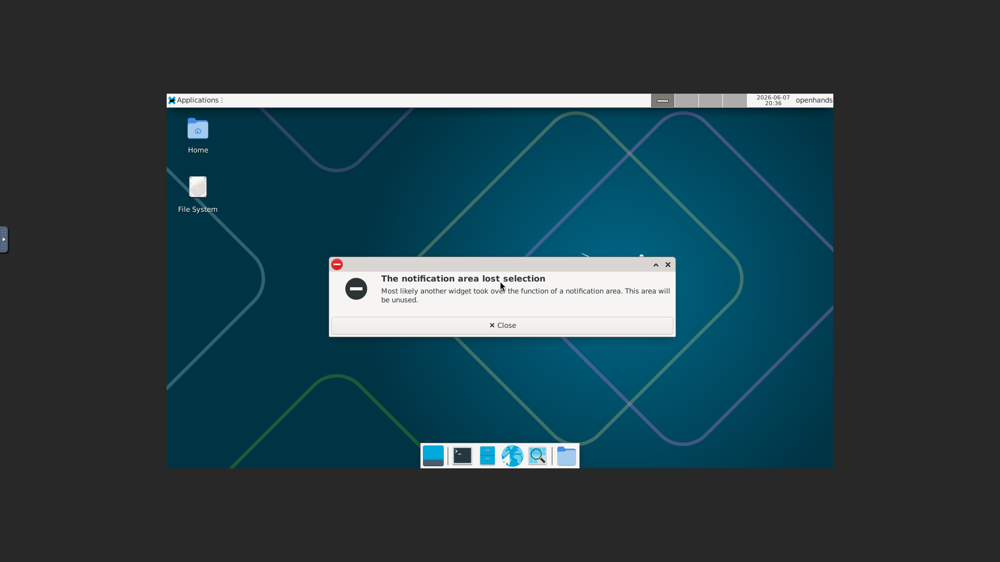
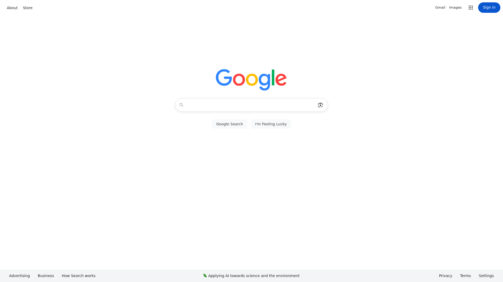

# VNC/noVNC Streaming Setup Guide

This guide explains how to set up TigerVNC, Xfce4, Websockify, and noVNC for browser-based remote desktop streaming.

## Screenshots

### noVNC Connect Screen


### noVNC Connected Desktop (Xfce4)


### Chromium Browser with Google


## Prerequisites

- Debian-based Linux system (tested on Debian Trixie)
- sudo access
- GitHub repository cloned: `VinnsEdesigner/vyzorix-update-server`

## Quick Setup (Copy-Paste Friendly)

Run these commands in order:

```bash
# Step 1: Install TigerVNC server
sudo apt-get update && sudo apt-get install -y tigervnc-standalone-server tigervnc-common tigervnc-tools

# Step 2: Install Xfce4 desktop environment
sudo apt-get install -y xfce4 xfce4-goodies

# Step 3: Install Websockify, noVNC, and ffmpeg
sudo apt-get install -y websockify novnc ffmpeg

# Step 4: Install Chromium browser
sudo apt-get install -y chromium

# Step 5: Create VNC configuration directory
mkdir -p ~/.vnc

# Step 6: Create VNC xstartup script
cat > ~/.vnc/xstartup << 'EOF'
#!/bin/sh
unset SESSION_MANAGER
unset DBUS_SESSION_BUS_ADDRESS
export XKL_XMODMAP_DISABLE=1
export XDG_CURRENT_DESKTOP=XFCE
export XDG_SESSION_TYPE=x11
dbus-launch --exit-with-session startxfce4 &
exec startxfce4
EOF
chmod +x ~/.vnc/xstartup

# Step 7: Create recordings directory
mkdir -p ~/recordings

# Step 8: Create persistent recording script
cat > ~/recordings/start_recording.sh << 'EOF'
#!/bin/bash
RECORD_DIR="$HOME/recordings"
mkdir -p "$RECORD_DIR"
while true; do
    TIMESTAMP=$(date +"%Y%m%d_%H%M%S")
    OUTPUT_FILE="$RECORD_DIR/recording_${TIMESTAMP}.mp4"
    echo "[$(date)] Starting recording: $OUTPUT_FILE"
    ffmpeg -f x11grab -i :1 \
        -c:v libx264 -preset ultrafast -tune zerolatency \
        -crf 23 -b:v 2000k -maxrate 2500k \
        -s 1280x720 -r 30 \
        -y "$OUTPUT_FILE" 2>&1 | tee -a "$RECORD_DIR/ffmpeg_recording.log"
    echo "[$(date)] Recording stopped, restarting..."
    sleep 2
done
EOF
chmod +x ~/recordings/start_recording.sh

# Step 9: Create VNC startup script
cat > ~/start_vnc.sh << 'EOF'
#!/bin/bash
export DISPLAY=:1
vncserver -kill :1 2>/dev/null || true
vncserver :1 -geometry 1280x720 -depth 24 -localhost no -securitytypes None --I-KNOW-THIS-IS-INSECURE -xstartup $HOME/.vnc/xstartup
echo "VNC server started on display :1"
echo "noVNC access: http://localhost:6080/vnc.html"
EOF
chmod +x ~/start_vnc.sh

# Step 10: Create persistent manager script
cat > /workspace/project/9138804fcca5422297075ca171f724df/persistent_stream.sh << 'EOF'
#!/bin/bash
LOG_DIR="$HOME/vnc_logs"
mkdir -p "$LOG_DIR"
echo "=============================================="
echo "VNC/Streaming Persistent Manager"
echo "Started at: $(date)"
echo "=============================================="

start_vnc() {
    echo "[$(date)] Starting VNC server..."
    export DISPLAY=:1
    vncserver -kill :1 2>/dev/null || true
    sleep 1
    vncserver :1 -geometry 1280x720 -depth 24 -localhost no -securitytypes None --I-KNOW-THIS-IS-INSECURE -xstartup $HOME/.vnc/xstartup >> "$LOG_DIR/vnc.log" 2>&1
    echo "[$(date)] VNC server started on :1"
}

start_websockify() {
    echo "[$(date)] Starting Websockify..."
    pkill -f "websockify.*6080" 2>/dev/null || true
    sleep 1
    websockify --web=/usr/share/novnc 6080 localhost:5901 >> "$LOG_DIR/websockify.log" 2>&1 &
    echo "[$(date)] Websockify started on port 6080"
}

start_vnc
sleep 2
start_websockify
sleep 1

while true; do
    if ! pgrep -f "Xtigervnc :1" > /dev/null; then
        echo "[$(date)] VNC crashed, restarting..."
        start_vnc
        sleep 2
    fi
    if ! pgrep -f "websockify.*6080" > /dev/null; then
        echo "[$(date)] Websockify crashed, restarting..."
        start_websockify
        sleep 1
    fi
    sleep 10
done
EOF
chmod +x /workspace/project/9138804fcca5422297075ca171f724df/persistent_stream.sh
```

## Running the Services

### Option A: Manual Start (for testing)
```bash
# Start VNC server
~/start_vnc.sh

# Start Websockify (in background)
websockify --web=/usr/share/novnc 6080 localhost:5901 &

# Start recording (optional)
nohup ~/recordings/start_recording.sh > /tmp/recording.log 2>&1 &
```

### Option B: Persistent Manager (recommended for production)
```bash
nohup /workspace/project/9138804fcca5422297075ca171f724df/persistent_stream.sh > /tmp/persistent_manager.log 2>&1 &
```

## Accessing noVNC

### From Inside the Container:
Open browser to: `http://localhost:6080/vnc.html`

### From External Machine:
The noVNC service runs on port 6080. Access depends on your network setup:

1. **Via work hosts (if configured)**:
   - `https://work-1-zjxhvtagdwtmvyft.prod-runtime.all-hands.dev/ (port 12000)`
   - `https://work-2-zjxhvtagdwtmvyft.prod-runtime.all-hands.dev/ (port 12001)`

2. **Direct IP access** (if firewall allows):
   - `http://10.2.10.25:6080/vnc.html`
   - `http://34.45.0.142:6080/vnc.html`

## Connecting Steps

1. Open `http://<host>:6080/vnc.html` in browser
2. Click "Connect" button (no password needed with `securitytypes None`)
3. Wait for connection - you should see the Xfce4 desktop

## Troubleshooting

### VNC already running error:
```bash
vncserver -list  # Check running servers
vncserver -kill :1  # Kill display :1
```

### Port already in use:
```bash
pkill -f websockify
sleep 2
websockify --web=/usr/share/novnc 6080 localhost:5901 &
```

### Check service status:
```bash
ps aux | grep -E "vnc|websock" | grep -v grep
tail -f ~/vnc_logs/vnc.log
tail -f ~/vnc_logs/websockify.log
```

### View recordings:
```bash
ls -la ~/recordings/
```

## File Locations

| File | Path |
|------|------|
| VNC xstartup | `~/.vnc/xstartup` |
| VNC logs | `~/.vnc/*.log` |
| Recordings | `~/recordings/` |
| VNC startup script | `~/start_vnc.sh` |
| Persistent manager | `/workspace/project/9138804fcca5422297075ca171f724df/persistent_stream.sh` |

## Security Notes

- Using `securitytypes None` exposes VNC without password authentication
- This is fine for internal/development use only
- For production, configure proper VNC passwords with `vncpasswd`
- noVNC traffic is unencrypted by default (ws://) - use wss:// with SSL certs for production