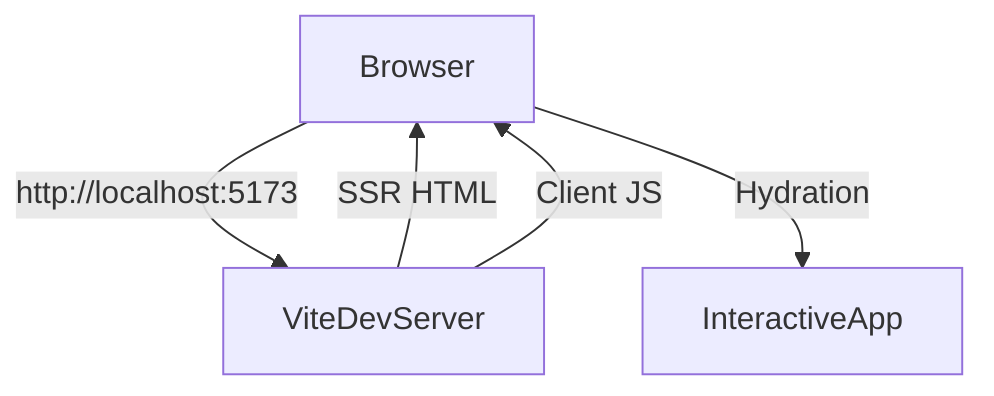
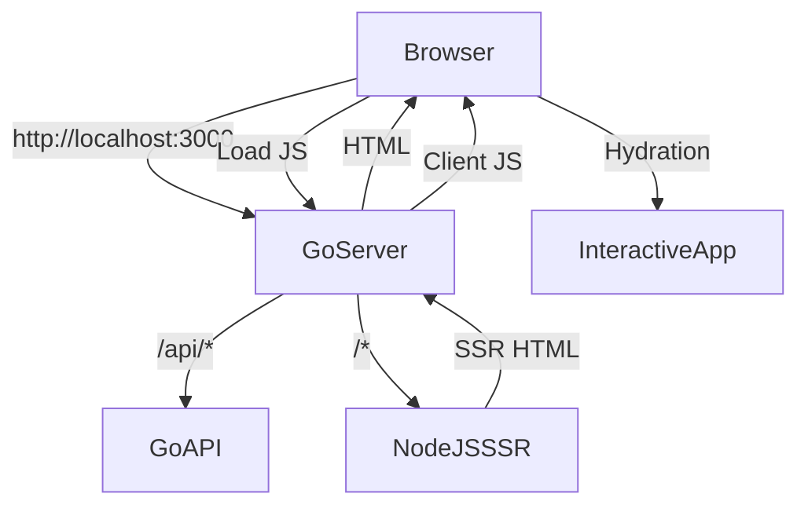

# SSR Setup Guide for Vyzorix Update Server

## Overview

This guide explains how to set up Server-Side Rendering (SSR) for the Vyzorix Update Server using TanStack Start. The system supports two modes:

1. **Development Mode**: Use Vite dev server with SSR
2. **Production Mode**: Use Node.js SSR server with Go proxy

## How TanStack Start Hydration Works

### Proper Flow (With SSR)

```
Browser → SSR Server → Full HTML with content → Browser → Hydration → Interactive app
```

### Current Issue (Empty HTML)

The current `index.html` is completely empty:

```html
<!doctype html>
<html lang="en">
  <head>
    <meta charset="utf-8" />
    <meta name="viewport" content="width=device-width, initial-scale=1" />
    <title>Vyzorix Update Server</title>
    <link rel="manifest" href="/manifest.json" />
    <link rel="stylesheet" href="/style.css" />
    <link rel="stylesheet" href="/assets/styles-DkrTJOXA.css" />
    <script type="module" src="/assets/index-FkQN1YgO.js"></script>
  </head>
  <body>
    <div id="app"></div>
  </body>
</html>
```

This empty HTML has no content for React to hydrate. The client JS loads but finds nothing to attach to.

### The Solution

For SSR to work properly, the HTML needs to contain the rendered content from the server:

```html
<!doctype html>
<html lang="en">
  <head>
    <meta charset="utf-8" />
    <meta name="viewport" content="width=device-width, initial-scale=1" />
    <title>Vyzorix Update Server</title>
    <link rel="manifest" href="/manifest.json" />
    <link rel="stylesheet" href="/style.css" />
    <link rel="stylesheet" href="/assets/styles-DkrTJOXA.css" />
    <script type="module" src="/assets/index-FkQN1YgO.js"></script>
  </head>
  <body>
    <!-- SSR Content Here -->
    <div id="app">
      <!-- Server-rendered HTML content -->
      <main>
        <p class="eyebrow">Vyzorix Phase 1.5</p>
        <h1>Update server online</h1>
        <p>REST, OTA, dashboard, and WebSocket endpoints are served by the Go backend.</p>
        <nav>
          <a href="/health">Health</a>
          <a href="/api/v1/version">Version manifest</a>
          <a href="/api/v1/changelog">Changelog</a>
        </nav>
      </main>
    </div>
  </body>
</html>
```

The server should render the full HTML content, then the client JS hydrates it to make it interactive.

## Development Mode (Recommended)

### Quick Start

```bash
# Start Vite dev server with SSR
cd apps/web
pnpm run dev -- --ssr
```

The Vite server will start on `http://localhost:5173` with:
- Hot module replacement
- SSR rendering
- Fast refresh

### Configuration

No additional configuration needed - Vite handles everything automatically.

## Production Mode

### Architecture

```
Browser → Go Server (port 3000)
         ↓
   /api/* → Go API handlers
   /v1/* → Go API handlers  
   /*    → Proxy to Node.js SSR server (port 3001)
         ↓
   Node.js SSR Server → Renders HTML with TanStack Start
```

### Setup

#### 1. Install Node.js SSR Server

```bash
cd apps/api
npm install
```

#### 2. Start Node.js SSR Server

```bash
cd apps/api
npm run prod
```

The SSR server will start on `http://localhost:3001`.

#### 3. Enable SSR in Go Server

Set environment variables:

```bash
export SSR_ENABLED=true
export SSR_SERVER_URL=http://localhost:3001
```

Or use `.env` file:

```env
SSR_ENABLED=true
SSR_SERVER_URL=http://localhost:3001
SSR_PORT=3001
```

#### 4. Start Go Server

```bash
cd apps/api
go run main.go
```

The Go server will now proxy HTML requests to the Node.js SSR server.

## Configuration Options

### Environment Variables

| Variable | Default | Description |
|----------|---------|-------------|
| `SSR_ENABLED` | `false` | Enable SSR mode (true/false) |
| `SSR_SERVER_URL` | `http://localhost:3001` | Node.js SSR server URL |
| `SSR_PORT` | `3001` | Node.js SSR server port |

### SSR Config in Go

```go
config.SSRConfig{
    EnableSSR:    true,  // Enable SSR
    SSRServerURL: "http://localhost:3001",
    SSRPort:     "3001",
}
```

## SSR Proxy Logic

The Go server uses middleware to determine which requests to proxy:

### Proxied Requests (to Node.js SSR server):
- `/` - Landing page
- `/login` - Login page
- `/dashboard` - Dashboard
- `/device` - Device page
- Any other HTML routes

### Not Proxied (handled by Go server):
- `/api/*` - API endpoints
- `/v1/*` - API endpoints
- `/health` - Health check
- `/bin/*` - Binary files
- `*.js`, `*.css`, `*.png` - Static assets

## Development vs Production

### Development Mode



**Pros:**
- Fastest development experience
- Hot module replacement
- Automatic SSR

**Cons:**
- Not suitable for production
- Vite dev server only

### Production Mode



**Pros:**
- Production-ready
- Go server handles API
- Node.js handles SSR
- Scalable architecture

**Cons:**
- More complex setup
- Requires Node.js server

## Troubleshooting

### SSR Not Working

1. **Check if SSR is enabled:**
   ```bash
   echo $SSR_ENABLED
   ```

2. **Check Node.js SSR server:**
   ```bash
   curl http://localhost:3001/health
   ```

3. **Check Go server logs:**
   ```bash
   # Look for "SSR disabled" or "Proxying to SSR server" messages
   ```

### Empty Page

If you see an empty page:
1. Check browser console for errors
2. Verify Node.js SSR server is running
3. Check network tab for failed requests
4. Ensure Go server has `SSR_ENABLED=true`

## Build Process

### Development Build

```bash
# Build web app for development
cd apps/web
pnpm run build

# Copy to Go public directory
cp -r dist/client/* ../api/public/
```

### Production Build

```bash
# Build web app for production
cd apps/web
pnpm run build

# Build Node.js SSR server
cd apps/api
npm run build

# Copy assets to Go public directory
cp -r ../web/dist/client/assets/* public/
cp ../web/dist/client/index.html public/
```

## Deployment

### Recommended Production Setup

1. **Node.js SSR Server** - Handles HTML rendering
2. **Go Server** - Handles API endpoints and proxies to Node.js
3. **Nginx/Apache** - Reverse proxy and load balancing
4. **PM2** - Process manager for Node.js

### Example PM2 Configuration

```yaml
# pm2.config.js
module.exports = {
  apps: [
    {
      name: 'vyzorix-ssr',
      script: 'apps/api/ssr-server.js',
      instances: 2,
      exec_mode: 'cluster',
      env: {
        NODE_ENV: 'production',
        SSR_PORT: 3001
      }
    }
  ]
}
```

Start with PM2:
```bash
pm2 start pm2.config.js
```

## Switching Between Modes

### Development → Production

1. Stop Vite dev server
2. Build web app: `pnpm run build`
3. Start Node.js SSR server: `npm run prod`
4. Set `SSR_ENABLED=true`
5. Restart Go server

### Production → Development

1. Set `SSR_ENABLED=false`
2. Restart Go server
3. Start Vite dev server: `pnpm run dev -- --ssr`

## Best Practices

1. **Use SSR in production** for better SEO and performance
2. **Use Vite dev server** during development for faster iteration
3. **Monitor SSR server** health and performance
4. **Implement caching** for SSR responses where appropriate
5. **Use load balancing** for Node.js SSR servers in production

## Files

- `apps/api/ssr-server.js` - Node.js SSR server
- `apps/api/ssr-package.json` - SSR server dependencies
- `apps/api/pkg/config/ssr.go` - SSR configuration
- `apps/api/internal/api/middleware/ssr-proxy.go` - SSR proxy middleware
- `SSR-SETUP.md` - This documentation

## Support

For issues with SSR setup:
1. Check logs first
2. Verify all servers are running
3. Test endpoints individually
4. Check browser console and network tab